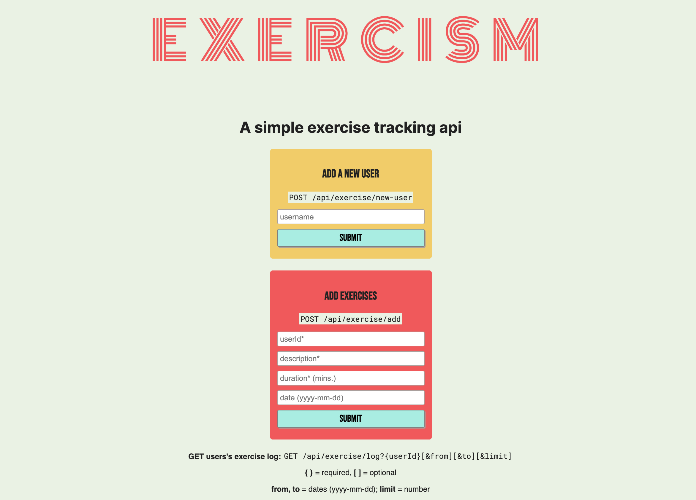

# Exercism

Exercism is a simple `REST` api for exercise tracking. You can:

1. Add a new user by calling `POST /api/exercise/new-user/{username}`. Exercism will check that no user already exists with that name.
2. Add exercise sessions to a user by calling `POST /api/exercise/add` and supplying `userId`, `description`, `duration` (in minutes), and an optional `date`.
3. View a list of all users by calling `GET /api/exercise/users`.
4. View a users logged exercises by calling `GET /api/exercise/log` and supplying `?userId={id}` as well as filtering the results with `&from={date}` and/or `&to={date}` and/or `&limit={number}`.

The application was created as part of the [FreeCodeCamp](https://www.freecodecamp.org) api and microservices challenges.